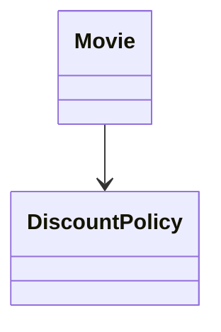
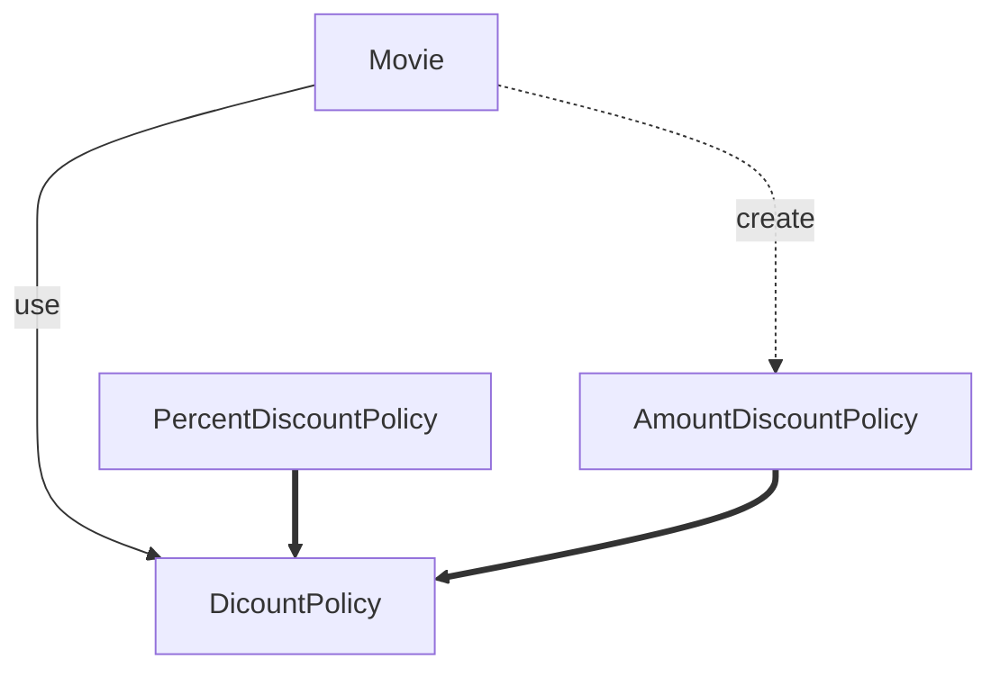
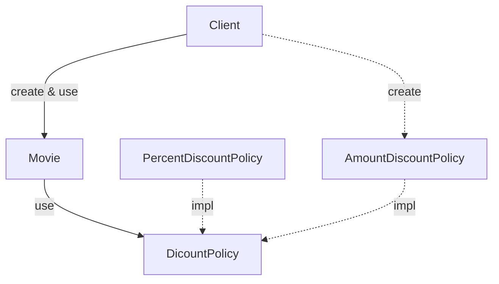
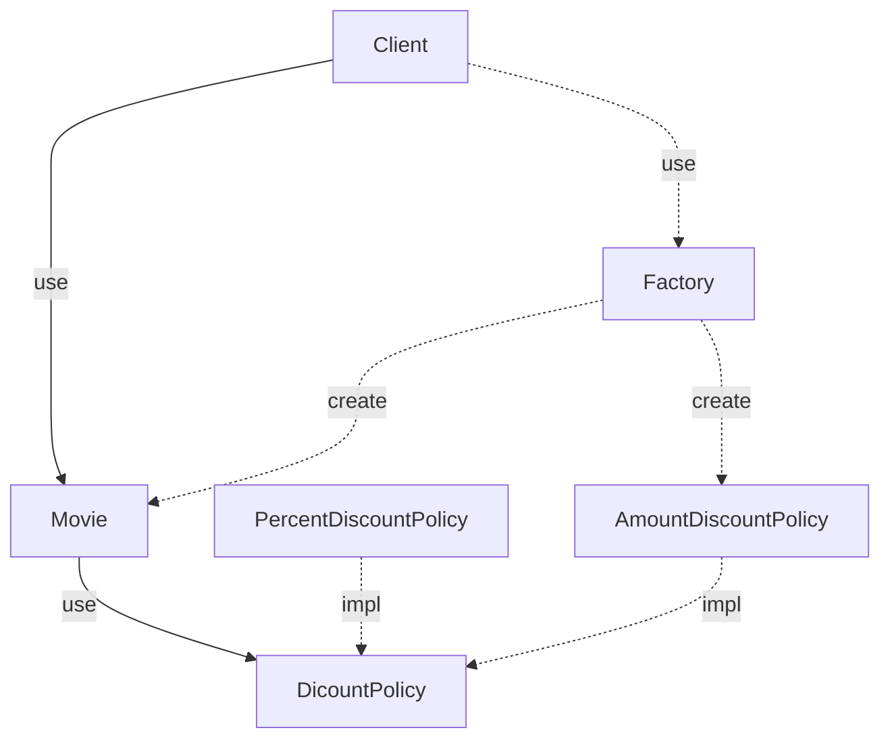
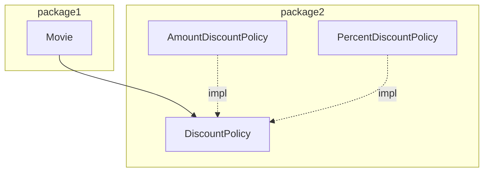
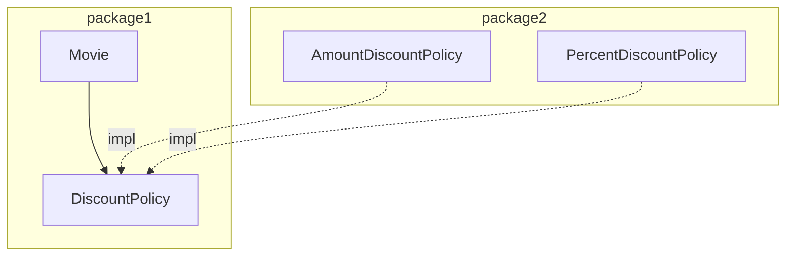

# 유연한 설계

ㅁㄴㅇㄹㅁㄴㅇㄹㅁㄴㅇㄹ

## OCP

확장 : 애플리케이션의 요구 사항이 변경될 때 이 변경에 맞게 새로운 '동작'을 추가해서 애플리케이션의 기능을 확장할 수 있다. 
수정 : 기존의 '코드'를 수정하지 않고도 애플리케이션의 동작을 추가하거나 변경할 수 있다. 

## 컴파일타임 의존성을 고정시키고 런타임 의존성을 변경하라

컴파일타임 의존성과 런타임 의존성은 동일하지 않다. 
OCP 를 수용하는 코드는 컴파일타임 의존성을 수정하지 않고도 런타임 의존성을 쉽게 변경할 수 있다. 

## 추상화가 핵심이다.

OCP는 추상화에 의존하는 것이다. 
OCP 관점에서 생략되지 않고 남겨지는 부분은 다양한 상황에서의 공통점을 반영한 추상화의 결과물이다. 
추상화를 통해 확장의 여지를 남긴다. 
OCP 에서 폐쇄를 가능하게 하는 것은 의존성의 방향이다. 

추상화는 확장을 가능하게 하고 추상화에 대한 의존은 폐쇄를 가능하게 한다.
추상화가 수정에 대해 닫혀 있을 수 있는 이유는 변경되지 않을 부분을 신중하게 결정하고 올바른 추상화를 주의 깊게 선택했기 때문이다. 

## 생성 사용 분리

객체 생성에 대한 지식은 과도한 결합도를 초래하는 경향이 있다. 

1. 객체를 생성하기만 하라.
2. 메시지를 전송하기만 하라.
3. 객체 생성과 사용이라는 두 목적을 공존하게 하지 마라. 

생성과 사용의 책임을 함께 맡고 있는 Movie 
생성과 사용을 분리해야 한다. 
생성의 책임은 클라이언트에게 옮기자 

Client에게 생성을 위임하고 Movie는 DiscountPolicy의 사용에만 집중한다. 

## 팩토리 추가하기

객체 생성을 전담하는 FACTORY를 추가한 후의 의존성 

## 순수한 가공물에게 책임 할당하기

FACTORY를 추가한 이유는 순수하게 기술적인 결정이다. 
표현적 분해 : 도메인에 존재하는 사물 또는 개념을 표현하는 객체들을 이용해 시스템을 분해하는 것이다. 
행위적 분해 : 어떤 행동을 추가하는데 이 행동을 책임질 마땅한 도메인 개념이 존재하지 않는다면 PURE FABRICATION을 추가하고 책임을 할당하라. 
책임을 할당하기 위해 창조되는 도메인과 무관한 인공적인 객체를 PURE FABRICATION(순수한 가공물) 이라고 부른다. 
먼저 도메인의 본질적인 개념을 표현하는 추상화를 이용해 애플리케이션을 구착하기 시작하라. 

PURE FABRICATION : 문제 도메인 개념을 표현하지 안흔, 인위적으로 또는 편의상 만든 클래스에 매우 응집된 책임을 할당하라. 

## 의존성 주입, 숨겨진 의존성은 나쁘다

SERVICE LOCATOR 패턴의 가장 큰 단점은 의존성을 감춘다는 것이다. 
숨겨진 의존성이 이해하기 어렵고 디버깅하기 어려운 이유는 문제점을 발견할 수 있는 시점을 코드 작성 시점이 아니라 실행 시점으로 미루기 때문이다. 
캡슐화는 코드를 읽고 이해하는 행위와 관련이 있다. 
명시적인 의존성이 숨겨진 의존성보다 좋다는 것이다. 

## 의존성 역전 원칙, 추상화와 의존성 역전

상위 수준 클래스는 하위 수준 클래스에 의존하면 안 된다. 
하위 수준 클래스가 상위 수준 클래스에 의존해야 한다. 
하위 수준 클래스의 수정 및 변경이 상위 수준 클래스에 영향을 끼치면 안 된다. 

객체 사이의 협력이 존재할 때 그 협력의 본질을 담고 있는 것은 상위 수준의 정책이다. 

## 의존성 역전 원칙과 패키지

Movie를 다양한 컨텍스트에서 재사용하기 위해서는 불필요한 클래스들이 Movie와 함께 배포돼야만 한다.

인터페이스의 소유권을 역전시킨 객체지향적인 구조 
객체 지향 패러다임에서는 상위 수준 모듈과 하위 수준 모듈이 모두 추상화에 의존한다. 

## 유연한 설계는 유연성이 필요할 때만 옳다.

유연하고 재사용 가능한 설계란 런타임 의존성과 컴파일타임 의존성의 차이를 인식하고 동일한 컴파일타임 의존성으로부터 다양한 런타임 의존성을 만들 수 있는 코드 구조를 가지는 설계를 의미한다. 
유연성은 코드를 읽는 사람들이 복잡함을 수용할 수 있을 때만 가치가 있다. 

## 협력과 책임이 중요하다.

역할, 책임, 협력에 초점을 맞추자. 
중요한 비즈니스 로직을 처리하기 위해 책임을 할당하고 협력의 균형을 맞추는 것이 객체 생성에 관한 책임을 할당하는 것보다 우선이다. 
핵심은 객체를 생성하는 방법에 대한 결정은 모든 책임이 자리를 잡은 후 가장 마지막 시점에 내리는 것이 적절하다. 
객체를 생성하는 방법을 먼저 신경쓰기 전에 시스템에 필요한 것(책임)들을 생각하자. 