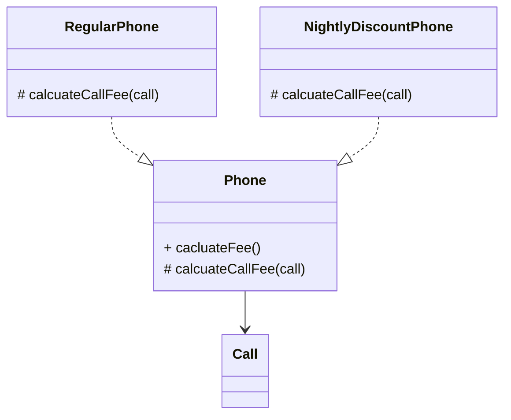

# 상속과 코드 재사용

중복된 코드를 제거하자.<br/>
새로운 클래스의 인스턴스 안에 기존 클래스의 인스턴스를 포함시키는 방법으로 흔히 합성이라고 부른다.<br/>

## 상속과 중복 코드, DRY 원칙

Don't Repeat Yourself 동일한 지식을 중복하지 말라.<br/>
중복 코드는 변경을 방해한다.<br />
중복 여부를 판단하는 기준은 변경이다.<br/>
모든 지식은 시스템 내에서 단일하고, 애매하지 않고, 정말로 믿을 만한 표현 양식을 가져야 한다.<br/>
한 번, 단 한번 원칙 or 단일 지점 제어 원칙이라고도 부른다.<br/>

## 중복과 변경

타입 코드를 사용하는 클래스는 낮은 응집도와 높은 결합도라는 문제에 시달리게 된다.<br/>

## 상속을 이용해서 중복 코드 제거하기

상속을 이용해 코드를 재사용하는 것은 높은 결합도를 낳는다.<br/>
개발자는 재사용을 위해 상속 계층 사이에 무수히 많은 가정을 세웠을지도 모른다, 그리고 그 가정은 코드를 이해하기 어렵게 만들뿐만 아니라 직관에도 어긋날 수 있다.<br/>
코드 중복을 제거하기 위해 상속을 사용했음에도 신규 로직을 추가하기 위해 새로운 중복 코드를 만들어야 한다.<br/>
취약한 기반 클래스 문제 : 자식 클래스가 부모 클래스의 변경에 취약해지는 현상<br/>

## 취약한 기반 클래스 문제

상속은 자식 클래스를 점진적으로 추가해서 기능을 확장하는 데는 용이하다.<br/>
객체지향의 기반은 캡슐화를 통한 변경의 통제다.<br/>

```java
    ...
public static void main(String[]args)throws IOException{

        Stack<String> st=new Stack<>();
        st.push("1");
        st.push("2");
        st.push("3");
        st.add(0,"test");
        System.out.println(st);
        }
        ...
        result=[test,1,2,3]
```

불필요한 인터페이스의 상속 문제로 인해 후입선출의 자료구조를 위반한다. <br/>

## 상속을 위한 경고

1. 자식 클래스의 메서드 안에서 super 참조를 이용해 부모 클래스의 메서드를 직접 호출할 경우 두 클래스는 강하게 결합된다. super 호출을 제거할 수 있는 방법을 찾아 결합도를 제거하라.<br/>
2. 상속받은 부모 클래스의 메서드가 자식 클래스의 내부 구조에 대한 규칙을 깨트릴 수 있다.<br/>
3. 자식 클래스가 부모 클래스의 메서드를 오버라이딩할 경우 부모 클래스가 자신의 메서드를 사용하는 방법에 자식 클래스가 결합될 수 있다.<br/>
4. 클래스를 상속하면 결합도로 인해 자식 클래스와 부모 클래스의 구현을 영원히 변경하지 않거나, 자식 클래스와 부모 클래스를 동시에 변경하거나 둘 중 하나를 선택할 수밖에 없다.<br/>

## 문제 해결의 열쇠는 바로 추상화

추상화에 의존하자.<br/>
부모 클래스와 자식 클래스 모두 추상화에 의존하도록 수정해야 한다.<br/>

1. 두 메서드가 유사하게 보인다면 차이점을 메서드로 추출하라.
    1. 메서드 추출을 통해 두 메서드를 동일한 형태로 보이도록 만들 수 있다.
2. 부모 클래스의 코드를 하위로 내리지 말고 자식 클래스의 코드를 상위로 올려라.
    1. 부모 클래스의 구체적인 메서드를 자식 클래스로 내리지 마라.
    2. 자식 클래스의 추상적인 메서드를 부모 클래스로 올려라.
    3. 재사용성과 응집도 측면에서 더 뛰어난 결과를 얻을 수 있다.

<br/>



공통 코드를 이동시킨 후에 각 클래스는 서로 다른 변경의 이유를 가진다.<br/>
세 클래스는 각각 하나의 변경 이유만을 가진다.<br/>
구체적인 구현에 의존하지 않는다. 오직 추상화에만 의존한다.<br/>

## 신규 요구사항 추가

인스턴스 변수의 목록이 변하지 않는 상황에서 객체의 행동만 변경된다면 상속 계층에 속한 각 클래스들을 독립적으로 진화시킬 수 있다.<br/>
하지만 인스턴스 변수가 추가되는 경우는 다르다.<br/>
자식 클래스가 부모 클래스의 인스턴스 변수를 초기화해야 하기 때문에 부모 클래스에 추가된 인스턴스 변수는 자식 클래스에 영향을 미친다.<br/>
하지만 중복 코드보다 현명한 선택이다.<br/>
메서드 구현에 대한 결합은 추상 메서드를 추가함으로써 어느 정도 완화할 수 있지만 인스턴스 변수에 대한 잠재적인 결합을 제거할 수 있는 방법은 없다.<br/>

## 차이에 의한 프로그래밍

이처럼 기존 코드와 다른 부분만을 추가함으로써 애플리케이션의 기능을 확장하는 방법을 차이에 의한 프로그래밍이라고 부른다.<br/>
상속을 이용하면 점진적인 정의가 가능해진다.<br/>
목적은 중복 코드를 제거하고 재사용하는 것이다.<br/>
