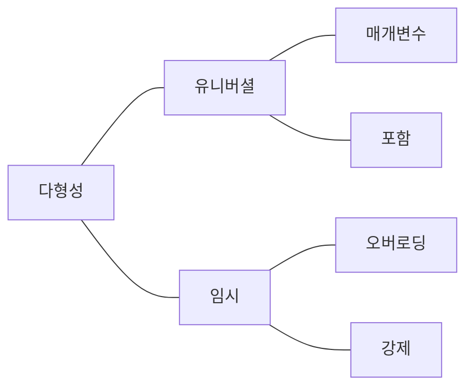
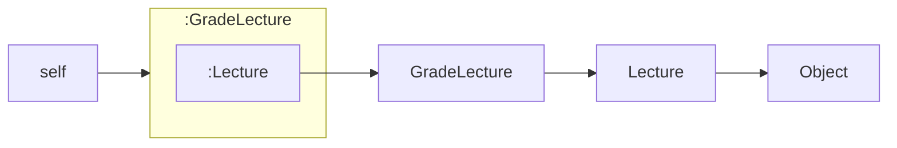

# 다형성

상속의 목적은 코드 재사용이 아니다. 
상속은 타입 계층을 구조화하기 위해 사용해야 한다. 

## 다형성

<Strong>오버로딩 다형성</Strong> : 하나의 클래스 안에 동일한 이름의 메서드 
<Strong>강제 다형성</Strong> : 언어가 지원하는 자동적인 타입 변환이나 사용자가 직접 구현한 타입 변환을 이용해 동일한 연산자를 다양한 타입에 사용하는 것.(ex. int + int 와 String +
int 의 '+' 는 다르다.) 
<Strong>매개변수 다형성</Strong> : 제네릭 프로그래밍. 사용 시점에 구체적인 타입으로 지정하는 방식 
<Strong>포함 다형성</Strong> : 메시지가 동일하더라도 수신한 객체의 타입에 따라 실제로 수행되는 행동이 달라지는 것. 일반적인 다형성의 의미 

## 데이터 관점 상속

데이터 관점에서 상속은 자식 클래스의 인스턴스 안에 부모 클래스의 인스턴스를 포함하는 것으로 볼 수 있다. 

## 행동 관점 상속

런타임에 시스템이 자식 클래스에 정의되지 않은 메서드가 있을 경우 이 메서드를 부모 클래스 안에서 탐색한다. 

## 동적 바인딩

메시지를 수신한 객체부터 상속 계층의 최상위 클래스까지 탐색을 하여 메시지에 책임을 수행할 객체를 찾는다. 

## self

자동적인 메시지 위임 : 메시지를 이해할 수 없다면 상위 클래스에게 처리를 위임한다. 
동적인 문맥 사용 : 메시지를 처리할 객체는 런타임에 결정된다. 

## 자동적인 메시지 위임

상속을 이용할 경우 프로그래머가 메시지 위임과 관련된 코드를 명시적으로 작성할 필요가 없다. 
메시지는 상속 계층을 따라 부모 클래스에게 자동으로 위임된다. 
상속 계층을 정의하는 것은 메서드 탐색 경로를 정의하는 것과 동일하다. 

## 동적인 문맥

메시지를 전송하는 것. 현재 클래스의 메서드를 호출 하는 것이 아니라 <Strong> 현재 객체에게 메시지를 전송하는 것.</Strong> 

## self 대 super

super 예약어로 호출되는 메서드는 부모 클래스의 메서드가 아니라 더 상위에 위치한 조상 클래스의 메서드일 수도 있다. 
super 참조의 정확한 의도는 '지금 이 클래스의 부모 클래스에서부터 메서드 탐색을 시작하세요'다. 

slef 전송의 경우 : 메서드 탐색을 시작할 클래스를 반드시 실행 시점에 동적으로 결정해야. 
super 전송의 경우 : 메서드 탐색을 시작할 클래스를 컴파일 실행 시점에 정적으로 결정해야. 

## 상속 대 위임

self 참조는 동적인 문맥을 결정한다. 따라서 자식 클래스에서 부모 클래스로 self 참조를 전달하는 매커니즘으로 상속을 바라보는 것이다. 

위임은 본질적으로 자신이 정의하지 않거나 처리할 수 없는 속성 또는 메서드의 탐색 과정을 다른 객체로 이동시키기 위해 사용한다. 
이를 위해 위임은 항상 현재의 실행 문맥을 가리키는 self 참조를 인자로 전달한다. 바로 이것이 self 참조를 전달하지 않는 포워딩과 위임의 차이점이다. 

## 포워딩과 위임

포워딩 : self 참조를 전달하지 않는 경우 
위임 : self 참조를 전달하는 경우 