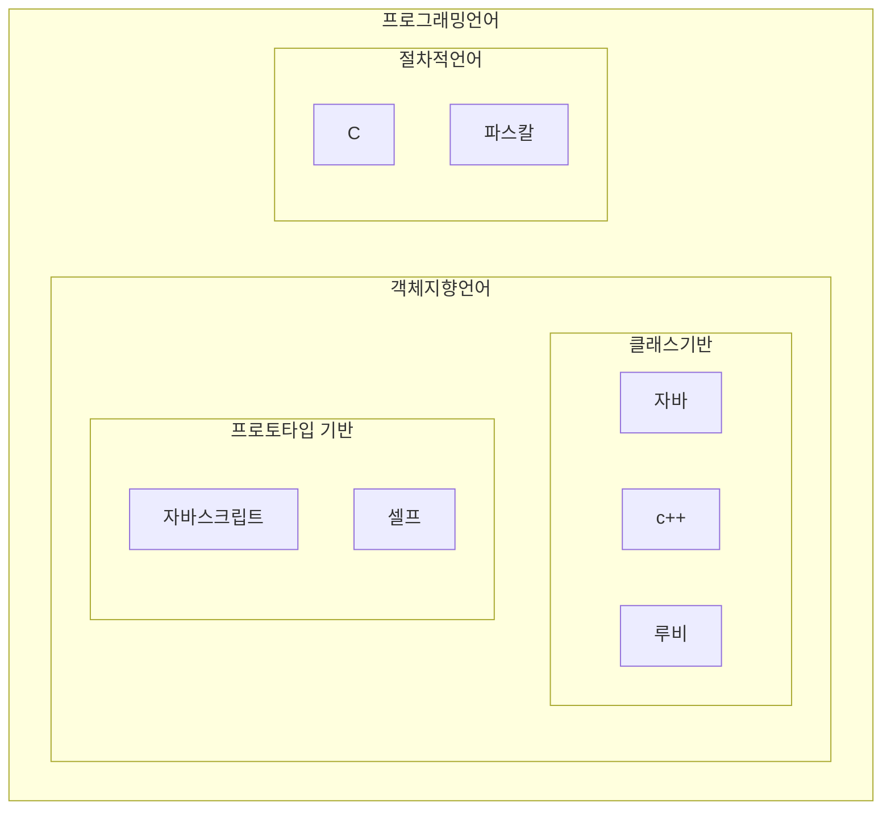
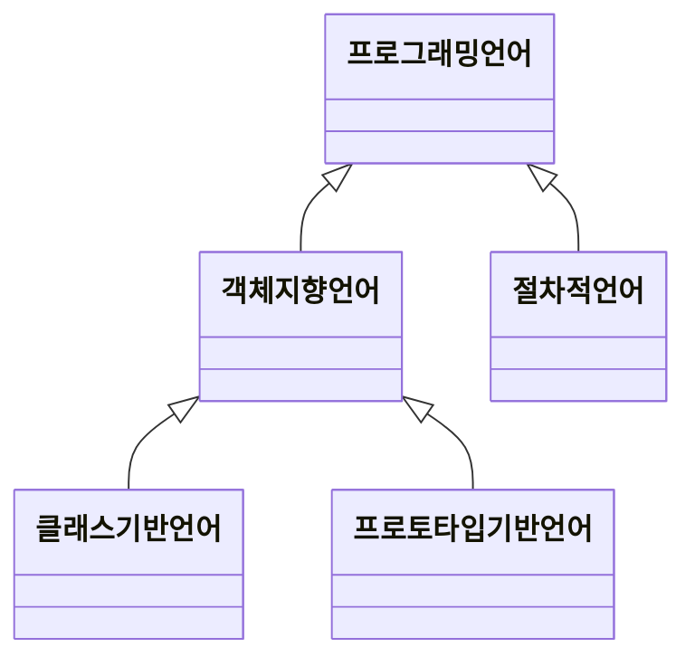
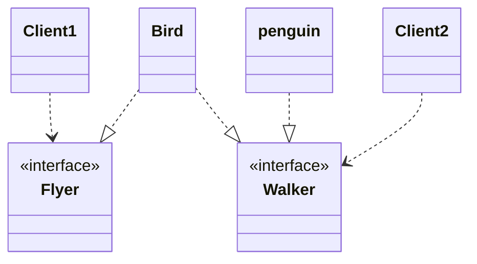
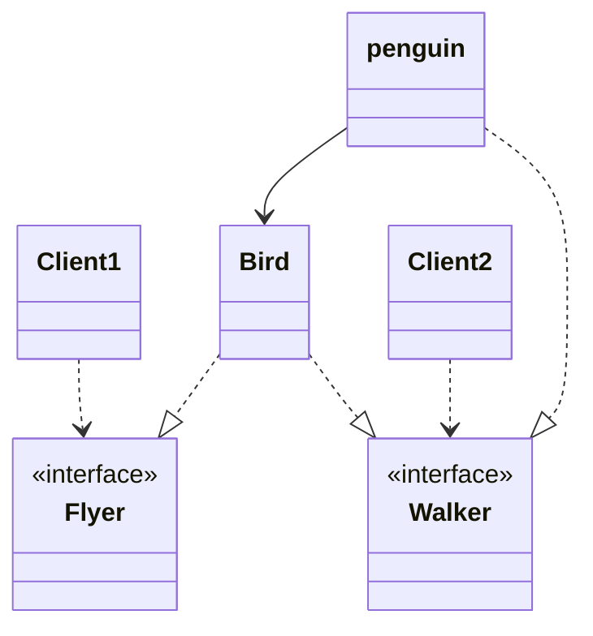

# 서브클래싱과 서브타이핑

상속의 첫 번째 용도는 타입 계층 구현 
상속의 두 번째 용도는 코드 재사용 
동일한 메시지에 대해 서로 다르게 행동할 수 있는 다형적인 객체를 구현하기 위해서는 객체의 행동을 기반으로 타입 계층을 구성해야 한다. 

## 개념 관점의 타입

타입은 사물을 분류하기 위한 틀 

- 심볼 : 타입에 이름을 붙인 것. (ex. 프로그래밍 언어) 
- 내연 : 타입의 정의. 타입에 속하는 객체들이 가지는 공통적인 속성이나 행동 
- 외연 : 타입에 속하는 객체들의 집함. (ex. 자바, 루비, 자바스크립트) 

## 프로그래밍 언어 관점의 타입

- 타입에 수행될 수 있는 유효한 오퍼레이션의 집합을 정의한다. 
- 타입에 수행되는 오퍼레이션에 대해 미리 약속된 문맥을 제공한다. 

타입은 적용 가능한 오퍼레이션의 종류와 의미를 정의함으로써 코드의 의미를 명확하게 전달하고 개발자의 실수를 방지하기 위해 사용된다. 

## 객체지향 패러다임 관점의 타입

- 객체의 타입이란 객체가 수신할 수 있는 메시지의 종류를 정의하는 것.

객체의 퍼블릭 인터페이스가 객체의 타입을 결정한다. 따라서 동일한 퍼블릭 인터페이스를 제공하는 객체들은 동일한 타입으로 분류된다. 

# 타입 계층

타입 계층을 구성하는 두 타입 간의 관계에서 

- 더 일반적인 타입은 슈퍼타입 
- 더 특수한 타입은 서브타입 

## 슈퍼타입과 서브타입

슈퍼타입 

- 집합이 다른 집합의 모든 멤버를 포함한다. 
- 타입의 정의가 다른 타입보다 좀 더 일반적이다. 

서브타입 

- 집합에 포함되는 인스턴스들이 더 큰 집합에 포함된다. 
- 타입 정의가 다른 타입보다 좀 더 구체적이다. 

## 객체지향 프로그래밍과 타입 계층

객체의 타입을 결정하는 것은 퍼블릭 인터페이스다. 
서브타입의 인스턴스는 슈퍼타입의 인스턴스로 간주될 수 있다. 

## 언제 상속을 사용해야 하는가?

상속의 올바른 용도는 타입 계층을 구현하는 것. 

클라이언트 입장에서 is-a 관계인가? 
클라이언트 입장에서 행동 호환성이 성립하는가? 

## 행동 호환성

클라이언트 관점에서 행동의 호환여부를 판단하라. 
클라이언트가 두 타입이 동일하게 행동할 것이라고 기대한다면 두 타입을 타입 계층으로 묶을 수 있다. 
Penguin은 클라이언트의 기대를 저버리기 때문에 bird의 서브타입이 아니다. 
flyBird 메서드는 모든 bird가 날 수 있다고 가정한다는 사실에 주목하라. 
일반적으로 `instancof` 처럼 객체의 타입을 확인하는 코드는 새로운 타입을 추가할 때마다 코드 수정을 요구하기 때문에 OCP 위반 

## 클라이언트의 기대에 따라 계층 분리하기

인터페이스는 클라이언트가 기대하는 바에 따라 분리돼야 한다. 

인터페이스를 클라이언트의 기대에 따라 분리함으로써 변경에 의해 영향을 제어하는 설계 원칙을 ISP 라 한다. 
설계가 꼭 현실 세계를 반영할 필요가 없다. 
중요한 것은 설계가 반영할 도메인의 요구사항이고, 그 안에서 클라이언트가 객체에게 요구하는 행동이다. 
클라이언트가 기대하는 행동에 집중하라. 

## 서브클래싱과 서브타이핑

- 서브클래싱 : 코드의 재사용 목적으로 상속을 사용하는 경우 
- 서브타이핑 : 타입 계층을 구성하기 위해 상속을 사용하는 경우 

사용의 목적으로 나눌 수 있다. 
추상 클래스를 상속한다는 것은 단순한 코드의 재사용을 위한 상속이 아니라 추상 클래스가 정의하고 있는 인터페이스를 상속하겠다는 의미인 것이다. 
어떤 타입이 다른 타입의 서브타입이 되기 위해서는 행동 호환성을 만족시켜야 한다. 

## 리스코프 치환 원칙 LSP

서브타입은 그것의 기반 타입에 대해 대체 가능해야 한다. 
행동 호환성을 유지함으로써 부모 클래스를 대체할 수 있도록 구현된 상속 관계만을 서브타이핑이라고 불러야 한다. 
직사각형과 정사각형은 클라이언트 관점에서 행동이 호환되지 않는다. 
대체 가능성을 결정하는 것은 클라이언트다. 
is-a 로 연결해 문장을 만들어도 어색하지 않은 단어로 네이밍해라. 

## 리스코프 치환 원칙은 유연한 설계의 기반이다.

- 의존성 역전 원칙 : 상위 수준의 모듈과 하위 수준의 모듈이 추상 클래스에 의존한다면 해당 설계는 DIP를 만족한다. 
- 리스코프 치환 원칙 : 클라이언트에 대한 영향 없이 대체가 가능하다면 해당 설계는 LSP를 만족한다. 
- 개방-폐쇄 원칙 : 새로운 기능을 추가하는 확장에 대해 기존 코드를 수정하지 않는다면 해당 설계는 OCP를 만족한다. 

## 타입 계층과 리스코프 치환 원칙

클래스 사이의 상속을 사용하지 않고 서브타이핑 관계를 구현할 수 있다. 
핵심은 구현 방법과 무관하게 클라이언트의 관점에서 슈퍼타입에 대해 기대하는 모든 것이 서브타입에게도 적용돼야 한다는 것. 
상속이 아닌 다른 방법을 이용하더라도 클라이언트 관점에서 서로 다른 구성 요소를 동일하게 다뤄야 한다면 서브타이핑 관계의 제약을 고려해서 LSP 를 준수해야한다. 

## 계약에 의한 설계와 서브타이핑

- 사전조건 
    - 서브타입에 더 강력한 사전조건을 정의할 수 없다.❌ 
    - 서브타입에 슈퍼타입과 같거나 더 약한 사전조건을 정의할 수 있다.⭕️ 
- 사후조건 
    - 서브타입에 슈퍼타입과 같거나 더 강한 사후조건을 정의할 수 있다.⭕️ 
    - 서브타입에 더 약한 사후조건을 정읳라 수 없다.❌ 
- 클래스 불변식 

464p : clcuateDiscountAmount 메서드가 정의한 사전조건을 만족시키는 것은 Movie의 책임이다. 